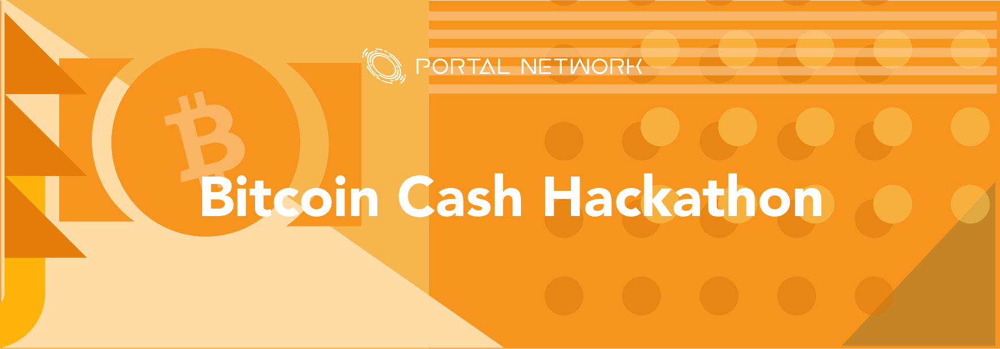

| [English](./README.md) | [한국어](./README_KR.md) | [中文(繁体)](./README_ZH.md) | [中文(简体)](./README_CN.md) |

Portal Network很荣幸邀请我们的合作伙伴加入Bitcoin Cash Hackathon。我们欢迎每个人使用不同的去中心化技术参与并解决面前的挑战。

[Website](https://www.portal.network) • [GitHub](https://github.com/PortalNetwork) • [Medium](https://medium.com/portalnetworkofficial) • [Twitter](https://twitter.com/itisportal) • [Telegram](https://t.me/portalnetworkofficial)

#Hackathon摘要

这份指南可以让您了解更多有关Portal Network和Bitcoin Cash(BCH)的信息。
您可以使用我们的工具构建一个托管在区块链名称服务上的分散式网站/应用程序。

#Blockchain名称服务(BNS)

什么是BNS？
BNS(或区块链域名系统)是网路上的一个协议，它将人类可理解的去中心化网站名称(例如“yourwebsite.bch”或“mywebsite.eth”)转换为去中心化网络机器可理解的地址。

＃比特币现金名称服务(BCNS)

使用BNS，您将能够通过'yourfriend.bch'而不是'pqkh9ahfj069qv8l6eys ...'向任何人发送BCH，在'mycontract.bch'与任何令牌合约互动，或者访问 'mywebsite.bch' 在上IPFS的去中心化网站。

##比特币现金简介
比特币现金是比特币的一个分支，核心的差异在于其区块的大小。每个区块大小从1MB增加到8MB，以处理不断增加的交易量。
使用比特币现金，交易者可以以更低的成本交易与更高的交易量，这会为更多的商业用途开辟空间。

## Wormholde简介
Wormhole协议基于Bitcoin Cash的交易;比特币现金脚本中的特殊操作码“OP_RETURN”用于将Wormhole协议附加到操作码。
一般来说：Wormhole交易是一种特殊的比特币现金交易，它使用与比特币现金交易相同的安全性和验证模型

###技术手册
Wornhole协议技术文件支援下面几种语言
- [英文](./WORMHOLE.md)
- [한국어](./WORMHOLE_KR.md)
- [中文(繁体)](./WORMHOLE_ZH.md)
- [中文(简体)](./WORMHOLE_CN.md)

##这个Hackathon是关于什么的？
加密货币对当前的经济产生了很大的影响。并且许多dApp和dWebs正在以颠覆性的方式影响电子商务和各个行业。而这个hackathon的目标是让开发人员和开发者社区将所有聪明的想法和应用带入去中心化网络。

在这个hackathon期间，全球社区将联系在一起，分享他们的经验和想法，以塑造未来的经济。加入我们，让我们一起解决持续存在的问题。
在这个黑客马拉松期间，全球社区将联系在一起，分享他们的经验和想法，以塑造未来的经济。加入我们，解决持续存在的人类贫困问题。

##规则
在hackathon期间，将使用3种技术：

- 比特币现金 - 比特币现金区块链。
- 虫洞 - 虫洞是一种基于Bitcoin Cash与Omni Layer上快速与简便的实现。
- Portal Network - 区块链域名服务和去中心化网站构建工具。

参与者将通过使用相关区块链的技术完成挑战。在活动结束时，每个团队都必须在舞台上准备一段演讲，以展示他们的想法或产品，评审将对其进行评分(有关更多信息，请参阅下面的评审部分。

参与者可以为个人(1人团队)或团队(2至5人团队)。演讲时间根据参加人数决定。

##技术

将使用我们生态系统中的几项技术

技术                     | 项目  
-------------------------|:-------------------------------------
Blockchain               | [Bitcoin Cash](https://www.bitcoincash.org/)
Wormhole                 | [Wormhole](https://github.com/copernet/wormhole)
Domain Name Service      | [Portal Network](https://www.portal.network/)
File Storage             | [IPFS](https://ipfs.io/)

##比特币现金
Bitcoin Cash是一种实验性数字货币，可以向世界任何地方的任何人提供即时支付。它使用点对点技术在没有中央权限的情况下运营：管理交易和发行资金由网络共同执行。比特币现金是比特币的延伸。
当它们在2017年8月1日硬分叉时，它变成了比特币核心支持的版本的单独货币.Bitcoin Cash和原始比特币版本在分割之前共享相同的交易历史。

##虫洞
Wormhole是一种快速，简便的Omni Layer实现，基于比特币ABC代码库(目前为0.17.2)。这种实现不需要与比特币ABC无关的外部依赖性，并且与其他比特币现金节点一样，是比特币现金网络的原生。它目前支持钱包模式，可在三个平台上无缝使用：Windows，Linux和Mac OS.Wormhole Cash Layer扩展通过JSON-RPC接口公开。开发已经整合到虫洞产品上，它是虫洞现金层的参考客户。

## Portal Network 
Portal Network 连接ENS，ECNS，WNS，BCNS，并提供基于智能合约平台的分布式，开放式和可扩展的命名系统。

## IPFS
IPFS是一种点对点超媒体协议，使网络更快，更安全，更透明。

## Hackathon挑战的描述
Hackathon挑战包含两个要求
- 技术
- 商业模式

### 1.技术需求

参与者需要使用所提供的技术来完成 Hackathon 专案。
Portal Network 将提供 Bitcoin Cash 服务器让参与者连接，并建立 Hackathon 专案。
**Bitcoin Cash 服务器将在稍后公布**

#### 挑战细节

Portal Network 提供dApp框架，其中包含并使用BNS和IPFS。

团队可以构建一个利用dApp框架来实现他们自己的想法，并通过Portal Network平台进行部署。您将获得与dApp相对应的IPFS链接和比特币现金域名服务。

### 2.商业模式要求
这个黑客马拉松不仅需求区块链技术，并且需要将其实施到实际应用中。因此，在可行的商业模式上建立的想法将是这个Hacakthon的第二个要求。

## 评分标准
1.利用区块链技术(25％)：

    区块链技术的产品或概念有多适合？这个概念真的需要区块链和令牌吗？  

2.概念的独创性(25％)：
    
    这个概念在解决这一挑战方面有多创新？这个概念是独特的吗？  

3.商业模式和营销策略(区块链众筹)(20％)：
    
    商业模式适合这个想法吗？这种营销策略会带来多大的影响？  
4.演讲(20％)：
    
    演讲风格和设计。
5.参与者的投票(10％)：

    每个参赛团队都会对自己喜欢的项目进行投票(不能投票给自己)。

## 评审

**持续更新**

## 许可和财产权利
所有发布的解决方案都可供其他人下载或使用。您同意任何原始内容(即您为挑战创建的内容)可以不受限制地免费获得，或者根据MIT许可证作为开源许可。
